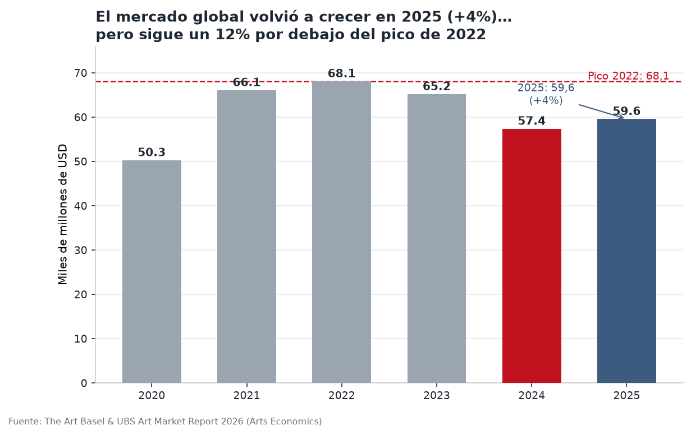
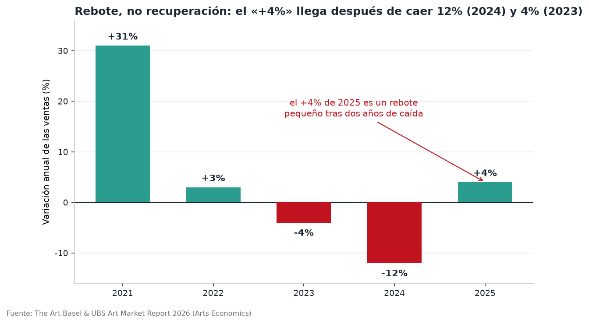
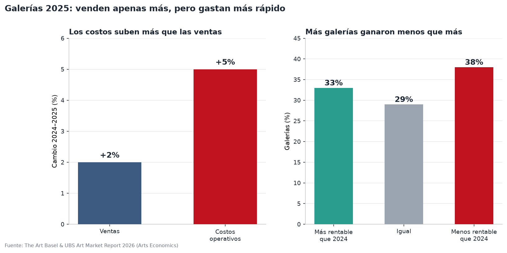
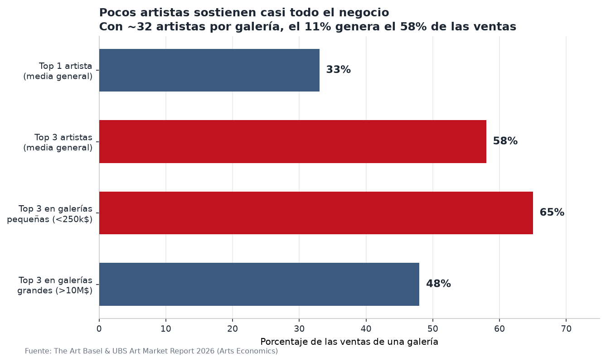
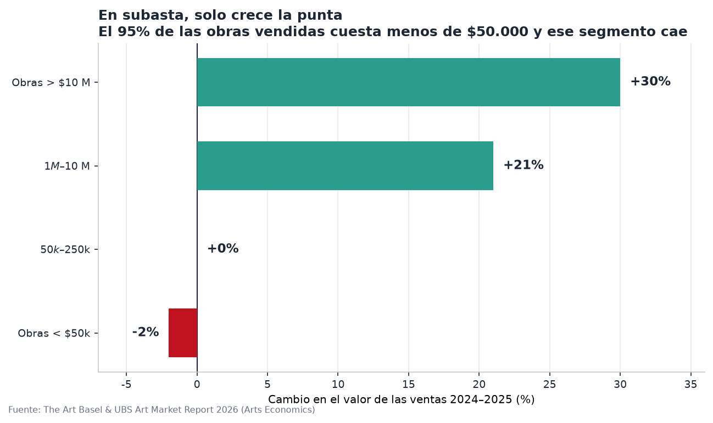
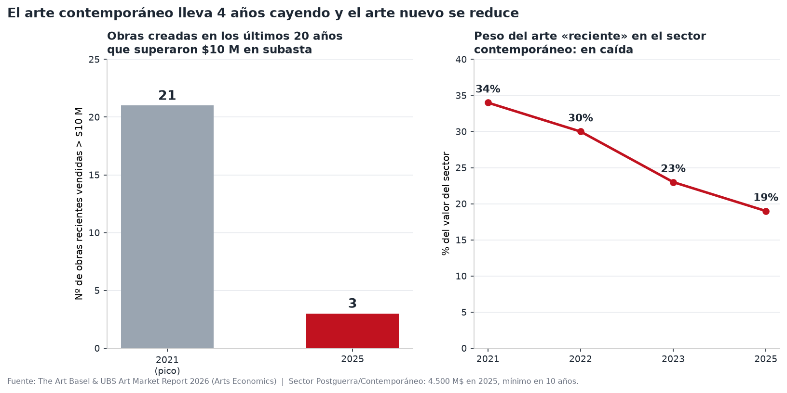
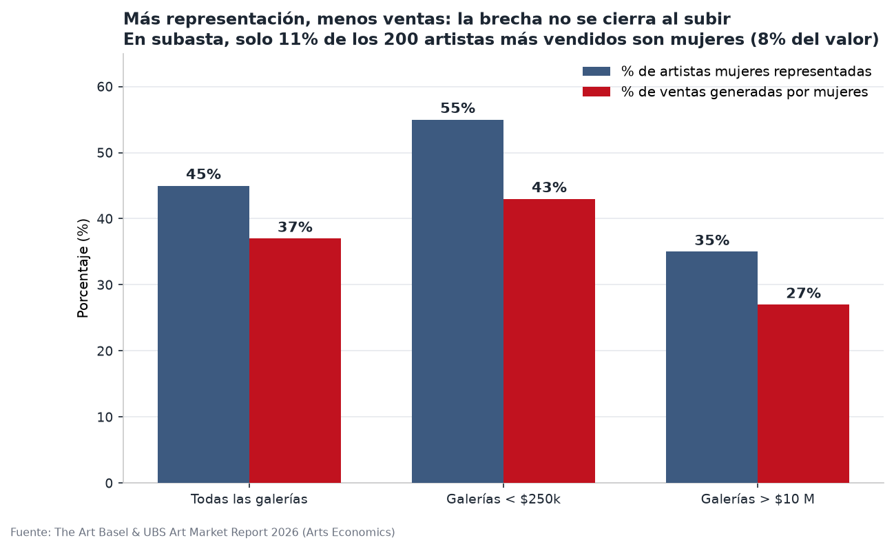

# El mercado del arte en 2025 por Riveros

Resumen visual y crítico de **The Art Basel and UBS Art Market Report 2026 by Arts Economics** (datos de 2025).

El objetivo de este material es **leer los datos sin el sesgo optimista** de los titulares: el informe habla de «recuperación», «retorno al crecimiento» y un «+4%», pero ese crecimiento es un rebote pequeño tras dos años de caída y sigue por debajo de los niveles de 2022 y de 2015.

---

## Resumen

> **EL MERCADO DEL ARTE EN 2025: QUÉ DICEN LOS DATOS**
> *(Resumen para artistas · Informe Art Basel & UBS 2026, datos de 2025)*
>
> 1. El titular dice "el mercado volvió a crecer 4%". Contexto: ese +4% llega tras caer 12% en 2024 y 4% en 2023. Las ventas globales (59.600 millones USD) siguen 12% por debajo del pico de 2022 y 7% por debajo de 2015. Es un rebote, no una recuperación.
> 2. Galerías: las ventas subieron 2%, pero sus costos operativos 5%. El 38% de las galerías ganó menos que en 2024 y solo el 33% ganó más. Vender más no significó ganar más.
> 3. Concentración: el artista más vendido de cada galería genera un tercio de su facturación; los tres primeros, el 58% (65% en galerías pequeñas). Con unos 32 artistas por galería, cerca del 11% produce el 58% de las ventas.
> 4. Subastas: solo crece la punta. Las obras de más de 10 millones subieron 30%, pero las de menos de 50.000 USD cayeron 2%. El 95% de las obras subastadas cuesta menos de 50.000 y ese mercado se encoge.
> 5. Arte contemporáneo: cuarto año consecutivo de caída (4.500 millones, mínimo en 10 años). Las obras recientes cayeron del 34% al 19% del valor del sector; las de más de 1 millón bajaron un tercio; las recientes sobre 10 millones pasaron de 21 (2021) a 3 (2025). Las ventas de artistas vivos cayeron 10%.
> 6. Género: las mujeres son el 45% de los artistas representados y el 37% de las ventas; en galerías grandes, 35% y 27%. Entre los 200 artistas más vendidos en subasta, solo el 11% son mujeres (8% del valor).
> 7. Compradores: cada galería vendió a 57 clientes en promedio (72 en 2024). Las más pequeñas, a 29 (-40%).
>
> **Conclusión:** la mejora de 2025 es real pero frágil, desigual y concentrada en obras carísimas y artistas ya consagrados. El mercado emergente y de rango medio sigue contrayéndose.

---

## Gráficos

### 1. El mercado global volvió a crecer… pero sigue 12% bajo el pico de 2022

Ventas mundiales del mercado del arte y de antigüedades, 2020–2025 (miles de millones de USD). En 2025 el mercado alcanzó 59.600 M USD (+4% interanual), pero sigue un 12% por debajo del pico de 2022 (68.100 M USD) y un 7% por debajo de 2015.

*Fuente: Arts Economics (2026). Figuras 1.1 y 1.2 del informe.*

### 2. Rebote, no recuperación: el efecto-base del «+4%»

El +4% de 2025 llega después de una caída del 12% en 2024 y del 4% en 2023. Leer solo el último dato oculta el nivel desde el que se recupera.

*Fuente: Arts Economics (2026). Serie elaborada a partir de las Figuras 1.1 y 1.2.*

### 3. Galerías: venden apenas más, pero gastan más rápido

Las ventas de las galerías crecieron un 2% en 2025, mientras que sus costos operativos subieron un 5% (por encima de la inflación de la mayoría de los mercados). El 38% de las galerías ganó menos que en 2024 y solo el 33% ganó más.

*Fuente: Arts Economics (2026). Secciones 2.3 y 2.5 (Figuras 2.22 y 2.25) del informe.*

### 4. Pocos artistas sostienen casi todo el negocio

El artista más vendido de cada galería genera un tercio (33%) de su facturación; los tres primeros, el 58% (65% en galerías que facturan menos de 250.000 USD). Con unos 32 artistas representados por término medio, alrededor del 11% de los artistas produce el 58% de las ventas.

*Fuente: Arts Economics (2026). Secciones 2.4 (Figuras 2.17, 2.18 y 2.19) del informe.*

### 5. En subasta, solo crece la punta

El valor de las obras de más de 10 M USD creció un 30% y el del tramo 1–10 M USD un 21%. En cambio, las obras de menos de 50.000 USD cayeron un 2%. El 95% de los lotes subastados cuesta menos de 50.000 USD y ese segmento se contrae.

*Fuente: Arts Economics (2026). Sección 3.4 (Figuras 3.9 a 3.12) del informe.*

### 6. El arte contemporáneo lleva cuatro años cayendo

El sector Postguerra y Contemporáneo facturó 4.500 M USD en subastas en 2025, su mínimo en 10 años y cuarto año consecutivo de caída. Las obras creadas en los últimos 20 años pasaron del 34% (2021) al 19% (2025) del valor del sector; las que superan 1 M USD cayeron cerca de un tercio; y las obras recientes vendidas por más de 10 M USD pasaron de 21 (2021) a 3 (2025). Las ventas de artistas vivos en el sector cayeron un 10% en 2025.

*Fuente: Arts Economics (2026). Sección 3.6 (Figuras 3.17, 3.18 y 3.22) del informe.*

### 7. Más representación, menos ventas: la brecha no se cierra al subir

Las mujeres son el 45% de los artistas representados y generan el 37% de las ventas. En galerías que facturan más de 10 M USD, son el 35% de los representados y solo el 27% de las ventas. En subasta, solo el 11% de los 200 artistas más vendidos son mujeres, con un 8% del valor total.

*Fuente: Arts Economics (2026). Secciones 2.4 y 3.6 (Figuras 2.20, 2.21 y 3.23) del informe.*

---

## Cómo leer estos gráficos

- **Cuidado con el efecto-base.** Un porcentaje positivo pequeño tras una caída grande no equivale a una recuperación. Compare siempre el nivel actual con el máximo previo.
- **Los promedios ocultan la distribución.** El crecimiento agregado de un segmento puede deberse a una minoría de negocios, no a la mayoría.
- **El valor no es el volumen.** En el mercado del arte, pocas obras carísimas concentran casi todo el valor, mientras la mayoría de las transacciones ocurren a precios bajos.

---

## Referencia

**Fuente original:**

> McAndrew, C. (2026). *The Art Basel and UBS Art Market Report 2026*. Arts Economics. Publicado por Art Basel y UBS.

- Autora: **Dr. Clare McAndrew**, Arts Economics.
- Editores y diseño: Toby Skeggs (editor), Mitchell F. Gillies (diseño).
- Publicado por **Art Basel** (artbasel.com) y **UBS** (ubs.com).
- Sitio de los informes de mercado: <https://theartmarket.artbasel.com>
- Arts Economics: <https://www.artseconomics.com>

**Datos citados dentro del informe:**

- Arts Economics, encuesta global a distribuidores (≈1.650 respuestas, diciembre de 2025).
- Winston Artory Group (datos de subastas de arte).
- Arts Economics / UBS, *Survey of Global Collecting 2025* (3.100 individuos de alto patrimonio, 10 mercados).
- UN Comtrade y USITC (datos de comercio internacional de arte y antigüedades).

**Cómo citar este resumen:**

> *El mercado del arte en 2025: resumen para artistas*, elaborado a partir de McAndrew, C. (2026), *The Art Basel and UBS Art Market Report 2026*, Arts Economics.

---

## Aviso legal

Este repositorio es un **resumen y análisis independiente** con fines informativos y educativos, elaborado a partir de un informe publicado por terceros. No está afiliado, patrocinado ni avalado por Art Basel, UBS ni Arts Economics.

El informe original indica (traducido): *«Todos los derechos reservados. Ninguna parte de esta publicación puede ser alterada o reproducida, publicada o almacenada en un sistema de recuperación, ni transmitida de ninguna forma o por ningún medio, electrónico, mecánico o de otro tipo, sin el consentimiento previo por escrito de Art Basel y UBS.»* Los derechos del informe original pertenecen a **© Arts Economics (2026)**, **Art Basel** y **© UBS 2026**. Consulte siempre el documento original para el texto y las figuras completas.

Este material no constituye asesoramiento financiero, legal, fiscal ni de inversión. Las cifras provienen de la fuente citada y pueden estar sujetas a revisiones posteriores.
